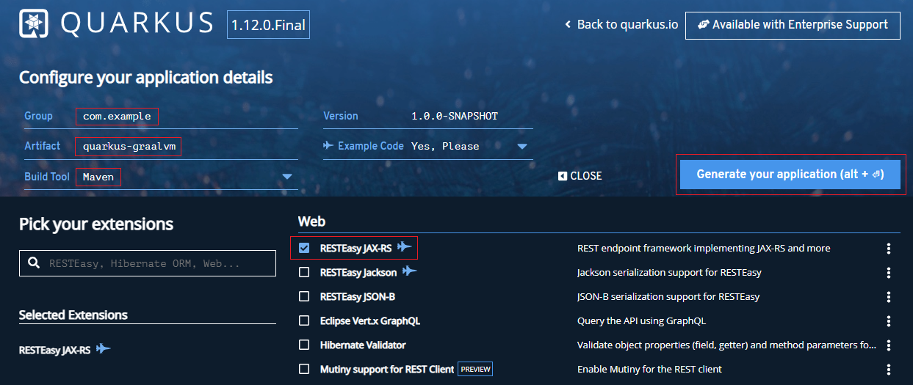
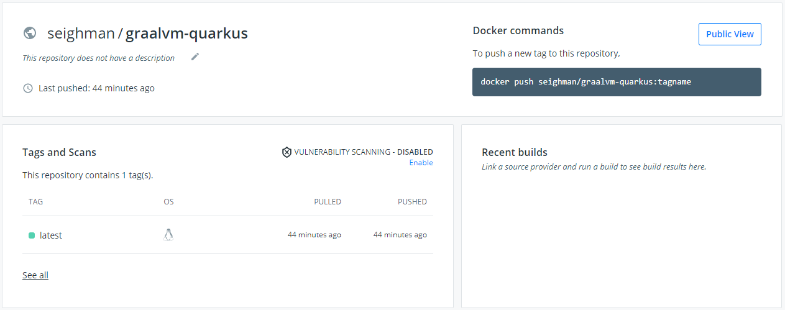
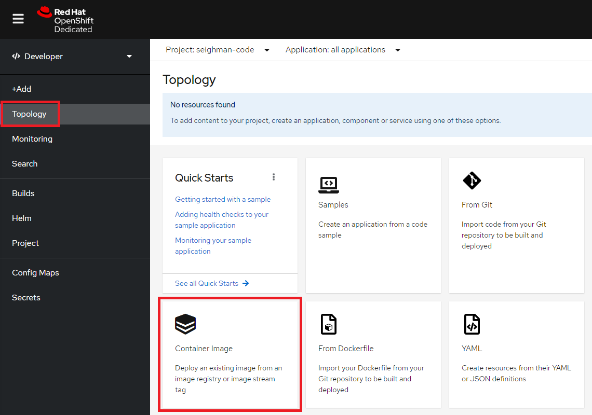
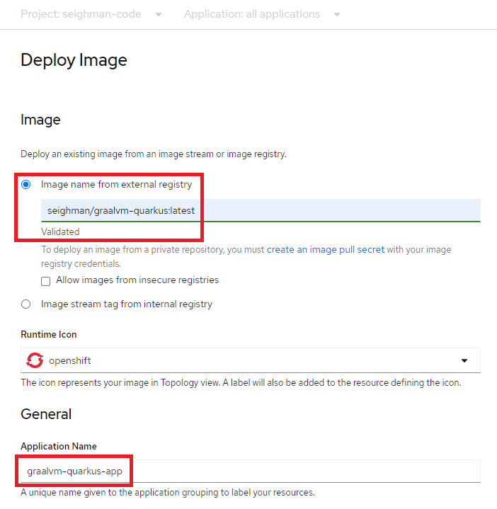
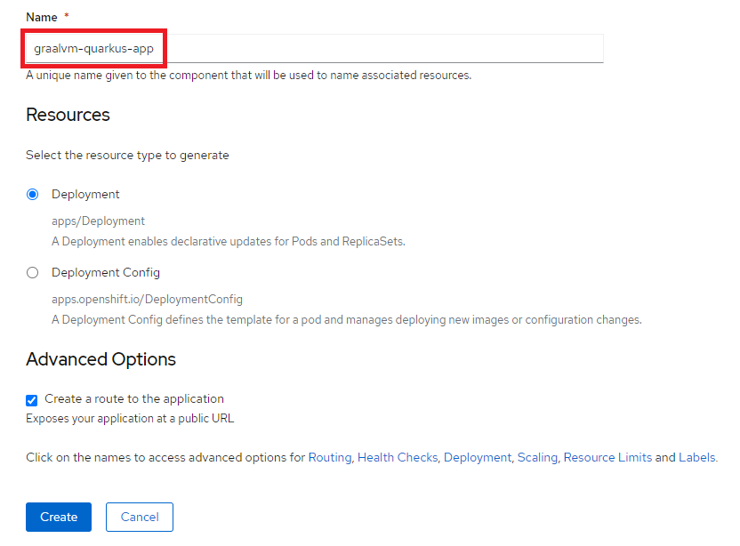
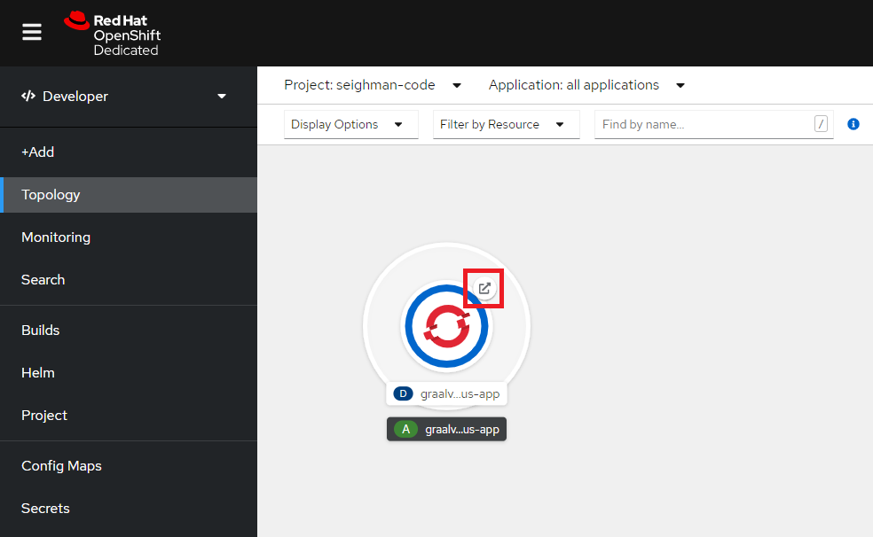
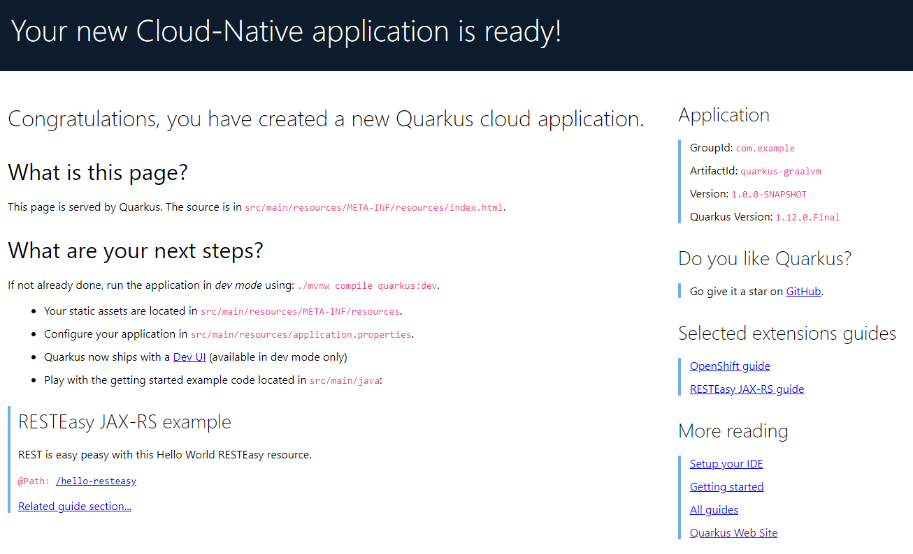
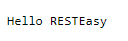
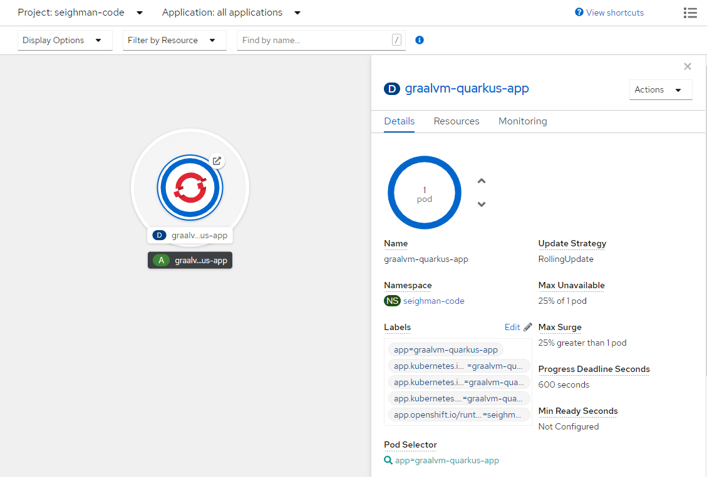
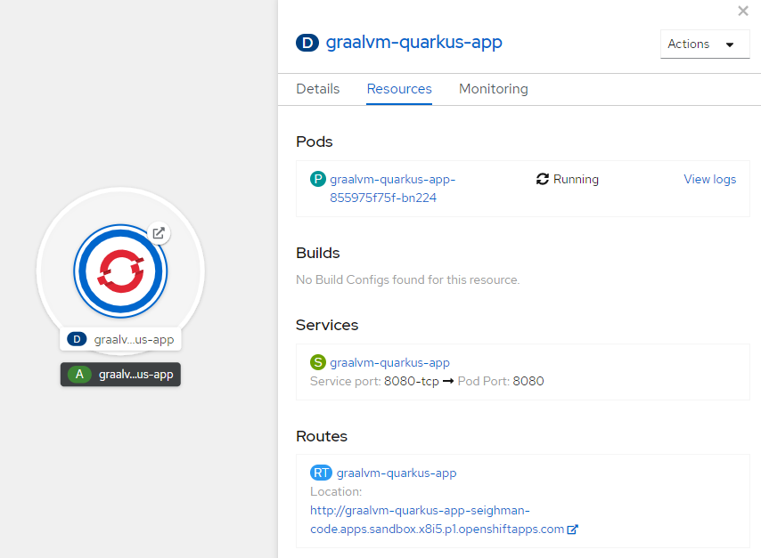

## Quarkus on GraalVM Enterprise

GraalVM is compatible with many of today's most popular microservices frameworks, including Micronaut, Quarkus and Spring Boot. In this tutorial, we'll focus on building an application using Quarkus.  We'll create a native image, a container and ultimately deploy the container to OpenShift.

Note: Throughout this tutorial, when you see a 
icon, it indicates a command that you'll need to enter in your terminal.


### Let's get started!

Browse to [https://code.quarkus.io/](https://code.quarkus.io/) and create a new project.



Group:  **com.example**  
Artifact: **quarkus-graalvm**  
Build Tool: **Maven**  
Choose **RESTEasy JAX-RS** extension


Download and unzip the `quarkus-graalvm.zip` project.

Install either [GraalVM Community Edition](https://www.graalvm.org/docs/getting-started/) or [GraalVM Enterprise Edition](https://github.com/swseighman/Installing-GraalVM-Enterprise-Edition).

Confirm your installation:


```
$ java -version
java version "11.0.10" 2021-01-19 LTS
Java(TM) SE Runtime Environment GraalVM EE 21.0.0 (build 11.0.10+8-LTS-jvmci-21.0-b06)
Java HotSpot(TM) 64-Bit Server VM GraalVM EE 21.0.0 (build 11.0.10+8-LTS-jvmci-21.0-b06, mixed mode, sharing

$ native-image --version
GraalVM Version 21.0.0 (Java Version 11.0.10+8-LTS-jvmci-21.0-b06)
```

Let's create a native image using GraalVM Enterprise Edition (for fun):


```
$ export GRAALVM_HOME=<path to your GraalVM install>; export GRAALVM_HOME
$ ./mvnw -DskipTests -Pnative clean package
$ target/quarkus-graalvm-1.0.0-SNAPSHOT-runner
__  ____  __  _____   ___  __ ____  ______
 --/ __ \/ / / / _ | / _ \/ //_/ / / / __/
 -/ /_/ / /_/ / __ |/ , _/ ,< / /_/ /\ \
--\___\_\____/_/ |_/_/|_/_/|_|\____/___/
2021-02-26 08:55:47,394 INFO  [io.quarkus] (main) quarkus-graalvm 1.0.0-SNAPSHOT native (powered by Quarkus 1.12.0.Final) started in 0.058s. Listening on: http://0.0.0.0:8080
2021-02-26 08:55:47,396 INFO  [io.quarkus] (main) Profile prod activated.
2021-02-26 08:55:47,396 INFO  [io.quarkus] (main) Installed features: [cdi, resteasy]
^C2021-02-26 08:57:19,176 INFO  [io.quarkus] (Shutdown thread) quarkus-graalvm stopped in 0.003s
```

You can also confirm what GraalVM distribution was used to build the native image:


```
$ strings target/quarkus-graalvm-1.0.0-SNAPSHOT-runner | grep GraalVM
GraalVM EE 21.0.0
```

### Build the Container Image

By default, the `.dockerignore` will exclude everything but the `target` directory during the image build so we'll need to edit `.dockerignore` and add the following exceptions:


```
!src
!pom.xml
```
And remove:

```
*
!maven-settings.xml
```

The end result `.dockerignore` should be:

```
!src
!pom.xml
!target/*-runner
!target/*-runner.jar
!target/lib/*
!target/quarkus-app/*
```

Now we can build the container image:


```
$ docker build -f src/main/docker/Dockerfile.multistage -t graalvm-quarkus .
```


```
$ docker images
REPOSITORY               TAG           IMAGE ID         CREATED           SIZE
graalvm-quarkus          latest        56fbba327b71     19 hours ago      96.3MB
```

To test:


```
$ docker run -i --rm -p 8080:8080 graalvm-quarkus
```
```
__  ____  __  _____   ___  __ ____  ______
 --/ __ \/ / / / _ | / _ \/ //_/ / / / __/
 -/ /_/ / /_/ / __ |/ , _/ ,< / /_/ /\ \
--\___\_\____/_/ |_/_/|_/_/|_|\____/___/
2021-02-26 14:14:47,102 INFO  [io.quarkus] (main) quarkus-graalvm 1.0.0-SNAPSHOT native (powered by Quarkus 1.12.0.Final) started in 0.056s. Listening on: http://0.0.0.0:8080
2021-02-26 14:14:47,105 INFO  [io.quarkus] (main) Profile prod activated.
2021-02-26 14:14:47,105 INFO  [io.quarkus] (main) Installed features: [cdi, resteasy]
```


```
$ curl http://localhost:8080/hello-resteasy
Hello RESTEasy
```

### Deploy to OpenShift Using the New Container

First, let's push our new container image to a registry.  For this example. we'll use DockerHub.


```
$ docker login
Authenticating with existing credentials...
Login Succeeded
$ docker tag graalvm-quarkus:latest seighman/graalvm-quarkus
$ docker push seighman/graalvm-quarkusUsing default tag: latest
The push refers to repository [docker.io/seighman/graalvm-quarkus]
e4f2332f0aea: Pushed
057acc6f6ada: Pushed
33f18c9a6e15: Pushed
latest: digest: sha256:d8cc4f5065b54ee9c806b... size: 1370
```
Over at [hub.docker.com](hub.docker.com), you can verify the image was added to your repository.



Next, you'll need to create a (free) OpenShift sandbox account. Start [here](https://developers.redhat.com/developer-sandbox).

Once your sandbox is enabled, login to your environment.  Click on `Topology` and then choose `Container Image`.



Enter the repository name, an application name and the name.  Click on `Create`.





After a minute or so, your application should appear in the `Topology`.  Click on the route (in the upper right-hand of the `Topology` icon) to access your application.





To access the endpoint, add `/hello-resteasy` to the route.

Example: 

```
http://graalvm-quarkus-app-seighman-code.apps.sandbox.x8i5.p1.openshiftapps.com/hello-resteasy
```



You can also scale the pods (up/down) and view other characteristics of your application by clicking on the application icon.





### (Alternative) Using the Quay Registry


```
$ docker ps -l
CONTAINER ID   IMAGE             COMMAND   CREATED         STATUS                       PORTS     NAMES
50ab0ee29ef5   graalvm-quarkus   "sh"      5 minutes ago   Exited (127) 5 minutes ago             keen_sinoussi
```


```
$ docker commit 50ab0ee29ef5 quay.io/scottseighman/graalvm-quarkus
```


```
$ docker push quay.io/scottseighman/graalvm-quarkus
```